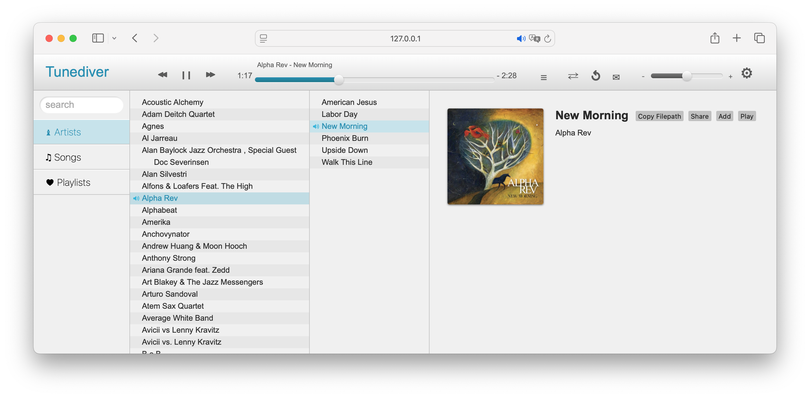

# Tunediver

Tunediver is a local music server and music-player webapp to listen
to your local music collection.




## API

The API is implemented with Rust's Rocket framework
and serves as a backend for the Tunediver webapp.
It provides endpoints to access and manage your local music collection.


### Endpoints

- List artists: `GET /api/artists`
- Songs by artist: `GET /api/artists/<artist>/songs`
- Single song: `GET /api/artists/<artist>/songs/<song>`
- Artist info: `GET /api/artists/<artist>`
- Stream audio file: `GET /<artist>/<song>` (Range requests supported)


### Building and Running

1. Make sure you have Rust and Cargo installed (https://rustup.rs/)
2. Build the API:
   ```sh
   make build
   ```
3. Run the API:
   ```sh
   make start
   ```


### Configuring Music Path

The top-level `make start` runs the server against `./example_music`.
To use your own path:

```sh
cd server && make start-with-path MUSIC_PATH=/path/to/your/music
```

You can also set `ROCKET_MUSIC_PATH` directly,
or edit `music_path` in `server/Rocket.toml`.

The API will be available at http://localhost:7313 by default.


### Auto-start at Login on macOS

A `launchd` LaunchAgent can start the server automatically whenever you
log in. The repo ships a portable wrapper script and a plist template.

**1. Build the release binary**

```sh
cd server && cargo build --release
```

This produces `server/target/release/tunediver-api`, which the wrapper
execs directly (no Rust toolchain needed at login).

**2. Prepare the LaunchAgent plist**

Copy the template, replace the three placeholders, and move it into
place:

```sh
REPO=/absolute/path/to/Tunediver
MUSIC=/absolute/path/to/your/music

sed \
  -e "s#REPLACE_REPO_PATH#$REPO#g" \
  -e "s#REPLACE_MUSIC_DIR#$MUSIC#g" \
  -e "s#REPLACE_HOME#$HOME#g" \
  "$REPO/server/scripts/com.tunediver.server.plist.example" \
  > ~/Library/LaunchAgents/com.tunediver.server.plist
```

**3. Load it**

```sh
launchctl bootstrap gui/$(id -u) \
  ~/Library/LaunchAgents/com.tunediver.server.plist
```

On next login (and immediately, thanks to `RunAtLoad`) the server will
start. The wrapper waits up to 5 minutes for `MUSIC_DIR` to be populated
before launching, so a slow Dropbox/iCloud sync at login doesn't result
in an empty catalog.

**Operations**

| Action    | Command |
|-----------|---------|
| Status    | `launchctl print gui/$(id -u)/com.tunediver.server` |
| Restart   | `launchctl kickstart -k gui/$(id -u)/com.tunediver.server` |
| Stop      | `launchctl bootout gui/$(id -u) ~/Library/LaunchAgents/com.tunediver.server.plist` |
| Logs      | `tail -f ~/Library/Logs/tunediver.{out,err}.log` |

After updating the server code, rebuild (`cargo build --release`) then
`launchctl kickstart -k gui/$(id -u)/com.tunediver.server` to pick up
the new binary.

The plist uses `RunAtLoad` only — no `KeepAlive`. If the server
crashes it stays down until the next login or manual kickstart.


## Project Structure

- `frontend/` — TypeScript webapp (`public/js/`), plain CSS (`public/css/`), assets (`public/img/`)
- `server/` — Rust/Rocket backend (`src/main.rs`, config in `Rocket.toml`)
- `desktop/` — Tauri 2 scaffold (not yet integrated)
- `design/` — design assets


## Front-end Development

The front-end uses vanilla JavaScript
with the [shaven](https://shaven.ad-si.com/) utility for DOM manipulation.
Sources in `frontend/public/js/` are written in TypeScript
and compiled to JavaScript with `make build`.


## Related

### Players

- [Feishin] - Modern self-hosted music player.
- [Harmonoid] - Plays & manages your music library.
- [Musicat] - Desktop music player and tagger for offline music.
- [Musicpod] - Music, radio, TV, and podcast desktop player.
- [Quod Libet] - Music player and music library manager.
- [Tauon] - Music player for the desktop.

[Feishin]: https://github.com/jeffvli/feishin
[Harmonoid]: https://github.com/harmonoid/harmonoid
[Musicat]: https://github.com/basharovV/musicat
[Musicpod]: https://github.com/ubuntu-flutter-community/musicpod
[Quod Libet]: https://github.com/quodlibet/quodlibet
[Tauon]: https://github.com/Taiko2k/Tauon


### Streaming Servers

- [Navidrome] - Music server

[Navidrome]: https://github.com/navidrome/navidrome/
